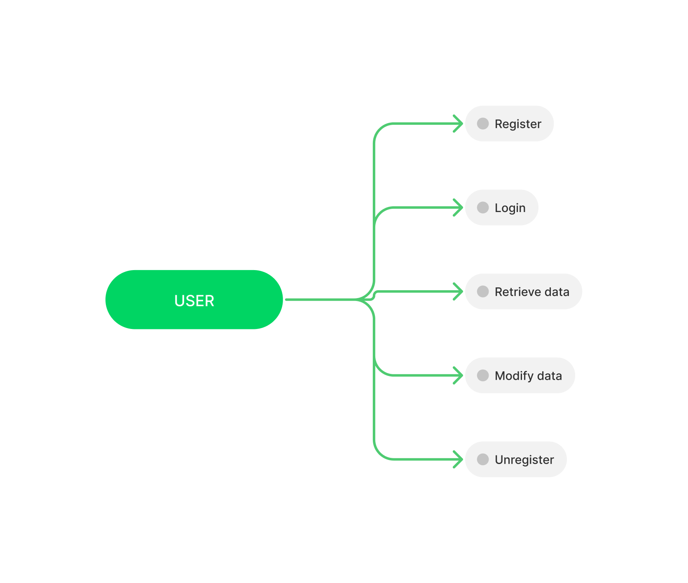
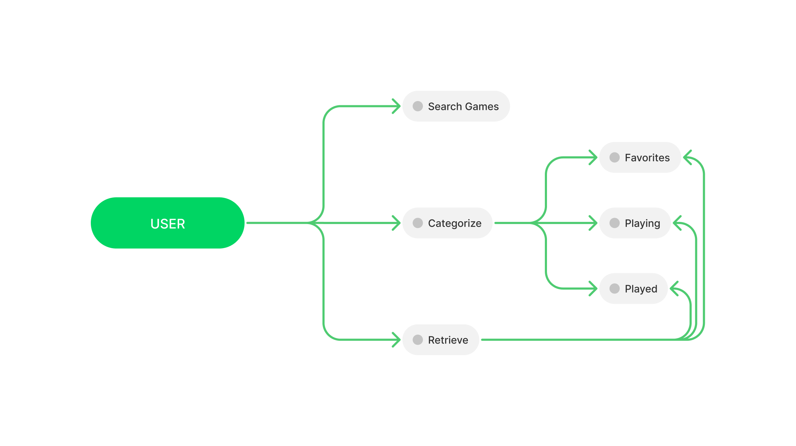
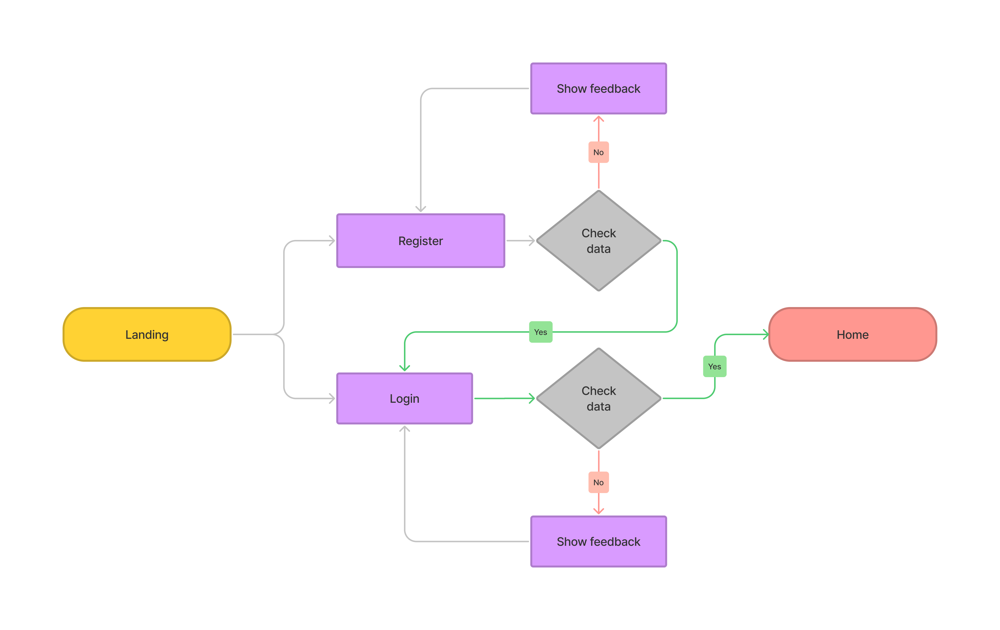
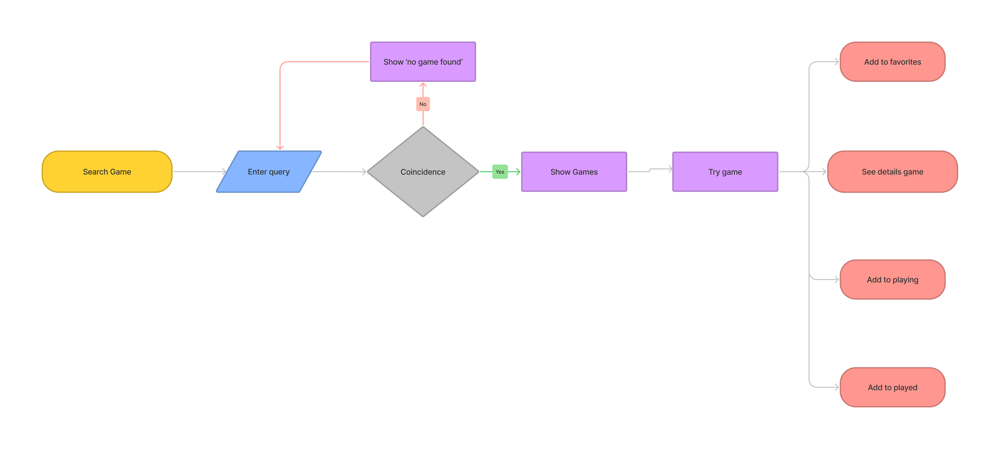
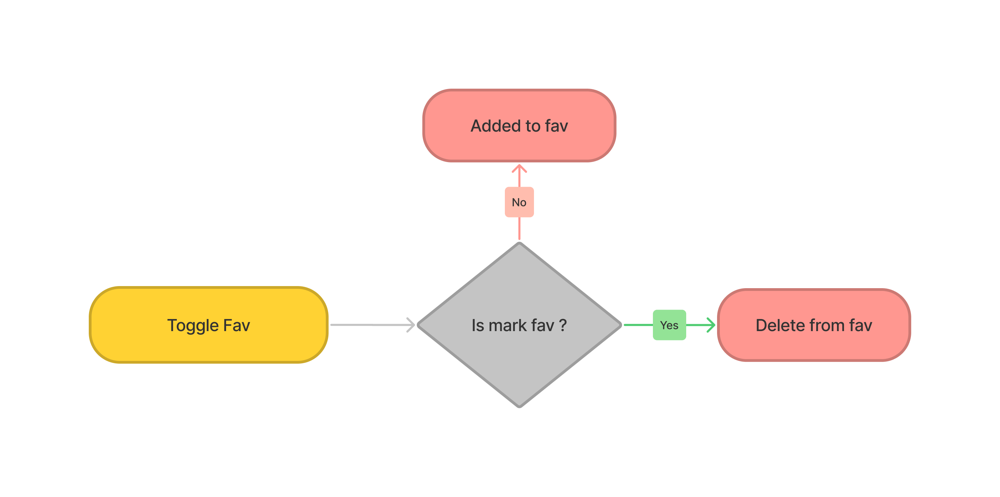
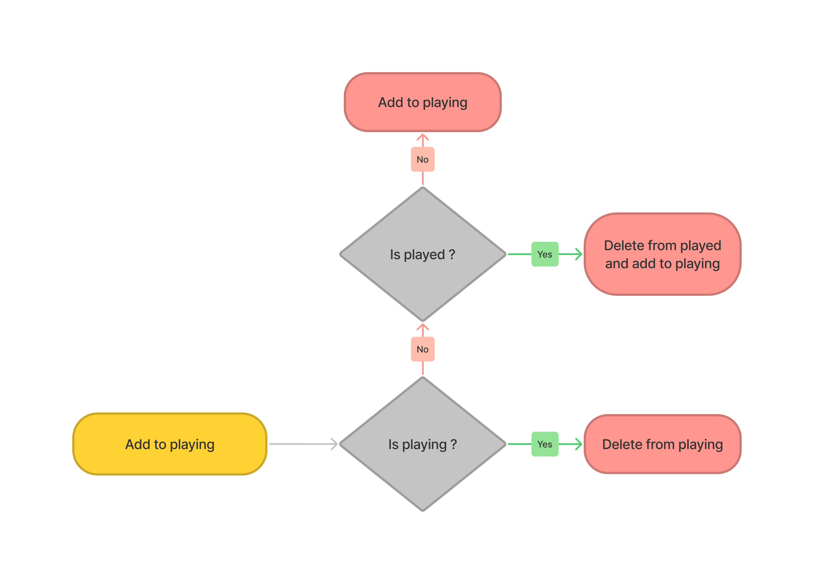
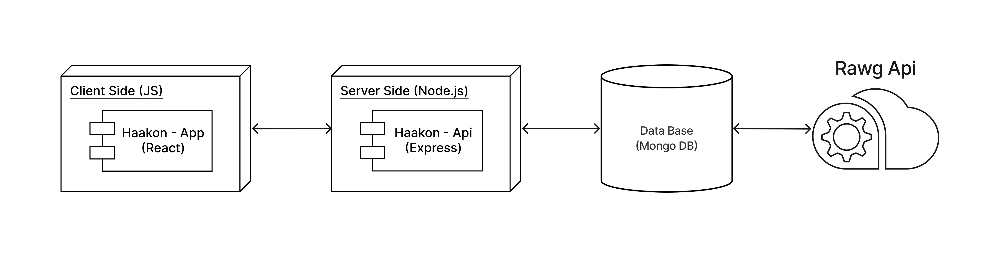
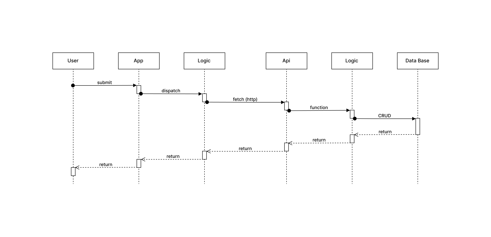
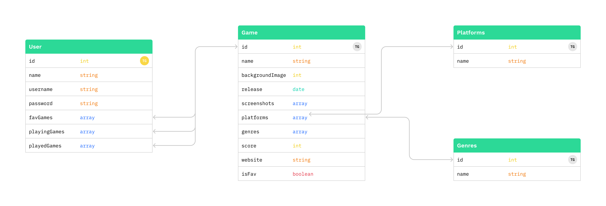
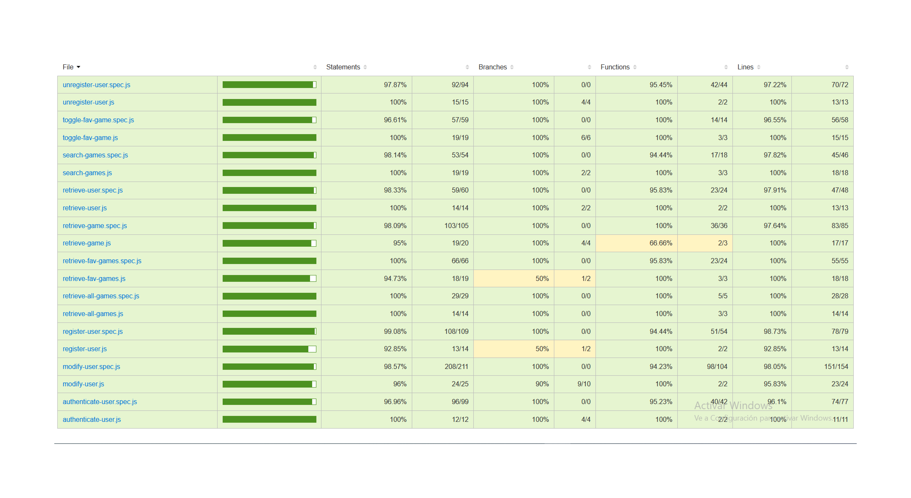

# Haakon

## Description

Haakon is an application where you can browse, search and explore a large database.

You will be able to mark the games you want, the ones you are playing, what you have finished.

### Installation Guide

- Clone this repository [here](https://github.com/EidrianMax/haakon) and see api and app documentacion.

## Use cases

## User Flow

### Login to Home

### Home to ...

## Functions Flow

### Toggle Fav

### Add to playing

## Technical Description

### Blocks

### Sequences

### Data Models

### Code Coverage

## Technologies

